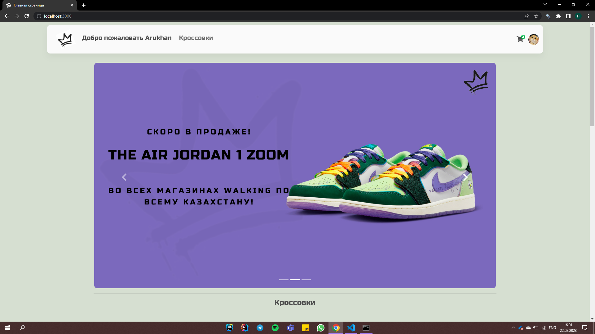
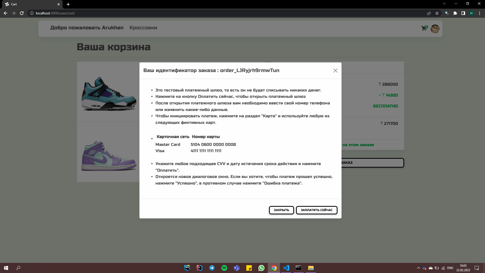

# "WALKING" SNAEKERS SHOW

"WalKing" is an E-commerce application built with CRUD functionality, and REST architechture. Online shop-website
where you will find different
types of sneakers from
different brands at
competitive prices.

> ## Tech Stack :
- EJS
- Express
- NodeJs
- MongoDb
- HTML/CSS/Bootstrap

> ## Features :
-  Login and sign in
Authentication

- Uploading of File type Image as jpeg/png format.
 

> ## **Functionalities :**
 

> ### **Products** :

- Adding a new product 
- Editing an existing Product
- Delete an Existing Products

> ### **User** :
- Register a New User with or without a profile picture
- Login/LogOut as an user
- Review a product and edit or delete that review only
- Add a item to cart / view carts Page
- Place an Order and make payment
- View Orders placed by the user.

>### **Admin** :
- Access the Admin panel to get control over , Products, Orders and User.
- View, Update or Delete all products
- View all the Users Info along with Cart Information and Orders Information
- View all the order information placed throughout the website.

# Screenshots

## Home page

## Item page

## Login page

## Register page

## Cart page

## Payment page 

## Admin Dashboard

## User Dash board

## Products Dash board

## Add a new Product

## Edit a Product

